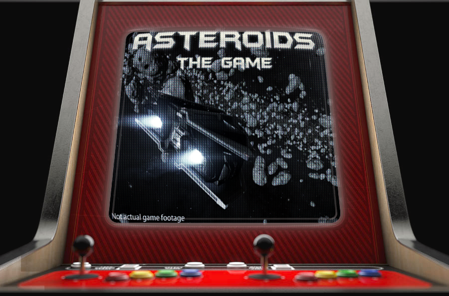

# Asteroids - The Game
#### Multithreading Project Assignment

Authors:
 * Andrzej Perczak (255948)
 * Mateusz Torski (259103)

This is a simple implementation of the Asteroids game using OpenGL and GLUT. The game involves controlling a spaceship to shoot down incoming asteroids while avoiding collisions. This game was inspired by old-schoold game Asteroids, you can find web-browser implementation [here](https://www.echalk.co.uk/amusements/Games/asteroidsClassic/ateroids.html).

Technologies used:
 * C++
 * OpenGL (GLUT)

## Functionality

The game includes the following features:

- Moving the spaceship left and right using the arrow keys.
- Shooting projectiles by pressing the spacebar.
- Generating random asteroids with varying shapes and sizes.
- Detecting collisions between the spaceship and asteroids, resulting in game over.
- Detecting collisions between projectiles and asteroids, awarding points for successful hits.
- Tracking health and score, displayed in the game window title.

## Threads and Mutexes

The application utilizes the following threads and mutexes:

1. `ship_move_thread`: A thread that handles the movement of the spaceship based on user input.
2. `asteroids_thread`: A thread responsible for updating the positions of the asteroids.
3. `shots_thread`: A thread responsible for updating the positions of the projectiles.
4. `asteroids_generator_thread`: A thread that generates new random asteroids.
5. `asteroids_mtx`: A mutex used to protect the access to the list of asteroids.
6. `shots_mtx`: A mutex used to protect the access to the list of projectiles.
7. `ship_pos_mtx`: A mutex used to protect the access to the spaceship's position.

## Building and Running

To build and run the Asteroids game, perform the following steps:

1. Install OpenGL and GLUT libraries.
2. Compile the source code using a C++ compiler with support for C++11 or later.
3. Execute the compiled binary to start the game.

Ensure that you have the necessary dependencies installed and configured correctly before attempting to build and run the game.

## Dependencies

The Asteroids game relies on the following dependencies:

- OpenGL
- GLUT

Make sure to have these libraries installed and available in your system.
